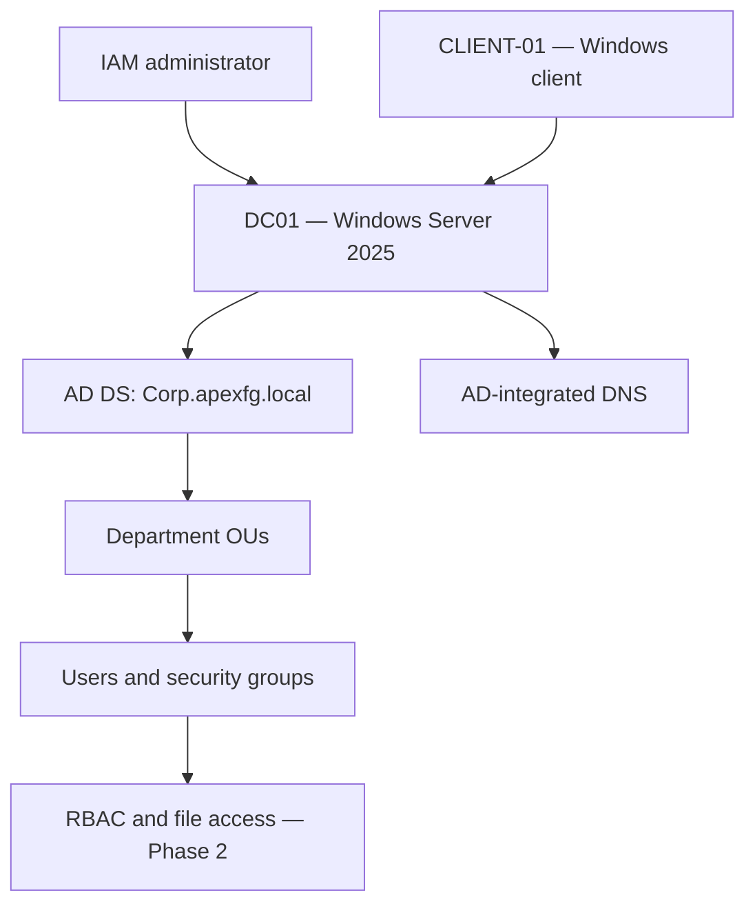

# Apex Financial Group IAM Security Lab

An evidence-driven identity and access management portfolio project for a fictional financial-services organization. The lab begins with a working Active Directory foundation and progresses through role-based access control, lifecycle automation, authentication hardening, privileged access, and governance.

## Project level

**Beginner to intermediate.** Phase 1 demonstrates foundational Windows identity administration. Later phases add access design, repeatable automation, security controls, and audit evidence.

## Scenario

Apex Financial Group is a fictional organization of approximately 500 employees. Its identity environment needs consistent account administration, least-privilege access, stronger authentication controls, and evidence that access decisions are implemented and tested.

This repository treats each phase as a small security engagement:

1. Define the business or security problem.
2. Explain the risk.
3. Design the control.
4. Implement it in the lab.
5. Validate expected and denied behavior.
6. Preserve evidence and lessons learned.

## Current status

| Phase | Capability | Status |
|---|---|---|
| 1 | Active Directory identity foundation | **Completed** |
| 2 | RBAC and departmental file access | **Implemented — validation refinement in progress** |
| 3 | Joiner, mover, and leaver automation | Planned |
| 4 | Authentication and Group Policy hardening | Planned |
| 5 | Privileged-access management | Planned |
| 6 | Governance, access review, and audit | Planned |
| Optional | Microsoft Entra hybrid extension | Conditional on licensing and tenant access |

## Architecture



## Verified Phase 1 environment

| Component | Configuration |
|---|---|
| Domain | `Corp.apexfg.local` |
| Domain controller | `DC01` |
| Server address | `192.168.102.10` |
| Client | `CLIENT-01` |
| Client address | `192.168.102.20` |
| Server OS | Windows Server 2025 Evaluation |
| Departments | HR, Finance, IT, Sales, Executives |
| Primary tools | Active Directory Users and Computers, PowerShell, DNS, Group Policy |

Phase 1 created the domain, department-based organizational units, eight representative user accounts, role-aligned security groups, and a domain-joined client. Domain logon, identity context, group membership, and name resolution were validated and captured as evidence.

See [Phase 1 — Identity Foundation](implementation/phase-01-identity-foundation/README.md).

Phase 2 added a departmental file share, Group Policy drive mapping, security filtering, and access tests for representative HR and Finance identities. The available evidence proves drive mapping, HR access for John Smith, root-share denial, and cross-department denial for Alex Williams. One Finance test was captured through the server's local path, so it must be repeated from the domain client before Phase 2 is marked complete.

See [Phase 2 — RBAC and File Access](implementation/phase-02-rbac-file-access/README.md).

## Skills demonstrated

- Active Directory Domain Services deployment and validation
- Organizational-unit and security-group design
- Identity provisioning and group membership administration
- Windows client domain join and authentication testing
- Role-based access-control design
- Least privilege and separation of administrative access
- PowerShell-oriented identity lifecycle planning
- Group Policy and audit-control planning
- Evidence collection and security documentation
- Troubleshooting configuration, permissions, and platform constraints

## Repository structure

```text
.
├── README.md
├── docs/
│   ├── company-profile.md
│   ├── identity-and-access-model.md
│   ├── lab-environment.md
│   ├── roadmap.md
│   └── restructure-notes.md
├── implementation/
│   ├── phase-01-identity-foundation/
│   ├── phase-02-rbac-file-access/
│   ├── phase-03-lifecycle-automation/
│   ├── phase-04-authentication-hardening/
│   ├── phase-05-privileged-access/
│   └── phase-06-governance-audit/
├── evidence/
│   ├── phase-01/
│   └── phase-02/
├── scripts/
├── templates/
└── optional-cloud-extension/
```

## Design principles

- **Least privilege:** Access is granted through role-based groups at the narrowest practical scope.
- **Group-based authorization:** Users are not assigned resource permissions directly.
- **Evidence before claims:** A control is marked complete only after positive and negative tests succeed.
- **Safe lab practice:** The environment uses fictional identities and contains no production data.
- **Progressive difficulty:** Each phase builds on the validated output of the previous phase.

## Known limitation

During Phase 1, DNS lookups resolved the required Active Directory records, but the client also displayed `Server: Unknown` and intermittent timeout messages. This did not prevent the domain join or domain authentication. The condition is recorded rather than hidden and should be investigated before any hybrid-cloud extension.

## Documentation

- [Company profile and business problem](docs/company-profile.md)
- [Lab environment](docs/lab-environment.md)
- [Identity and access model](docs/identity-and-access-model.md)
- [Project roadmap](docs/roadmap.md)
- [How the original project was reorganized](docs/restructure-notes.md)

## Ethics and scope

All identities and business details in this repository are fictional. The work is designed for an isolated training environment and should not be applied to a production domain without change control, backups, peer review, and organization-specific approval.
