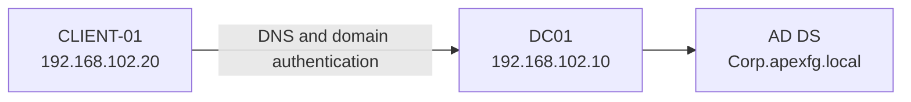

# Lab Environment

## Verified configuration

| Item | Value |
|---|---|
| Hypervisor | Local virtualized lab |
| Domain controller | `DC01` |
| Domain controller OS | Windows Server 2025 Evaluation |
| Domain controller IP | `192.168.102.10` |
| Active Directory domain | `Corp.apexfg.local` |
| Client computer | `CLIENT-01` |
| Client IP | `192.168.102.20` |
| Client DNS server | `192.168.102.10` |

## Logical layout

## Lab assumptions

- The environment is isolated and contains fictional data.
- `DC01` provides AD DS and DNS.
- Phase 2 may also use `DC01` as a file server to avoid adding another VM. This is acceptable for a resource-limited lab but is not the preferred production architecture.
- Screenshots must exclude personal information, passwords, license keys, and unrelated systems.

## Known DNS observation

The client successfully resolved required domain records and joined the domain. However, `nslookup` output also displayed `Server: Unknown` and intermittent timeouts. Likely investigation areas include reverse lookup configuration, the DNS server's own forward/reverse records, and the client adapter's DNS settings.

This is recorded as a limitation because successful authentication alone does not prove that every DNS condition is healthy.

